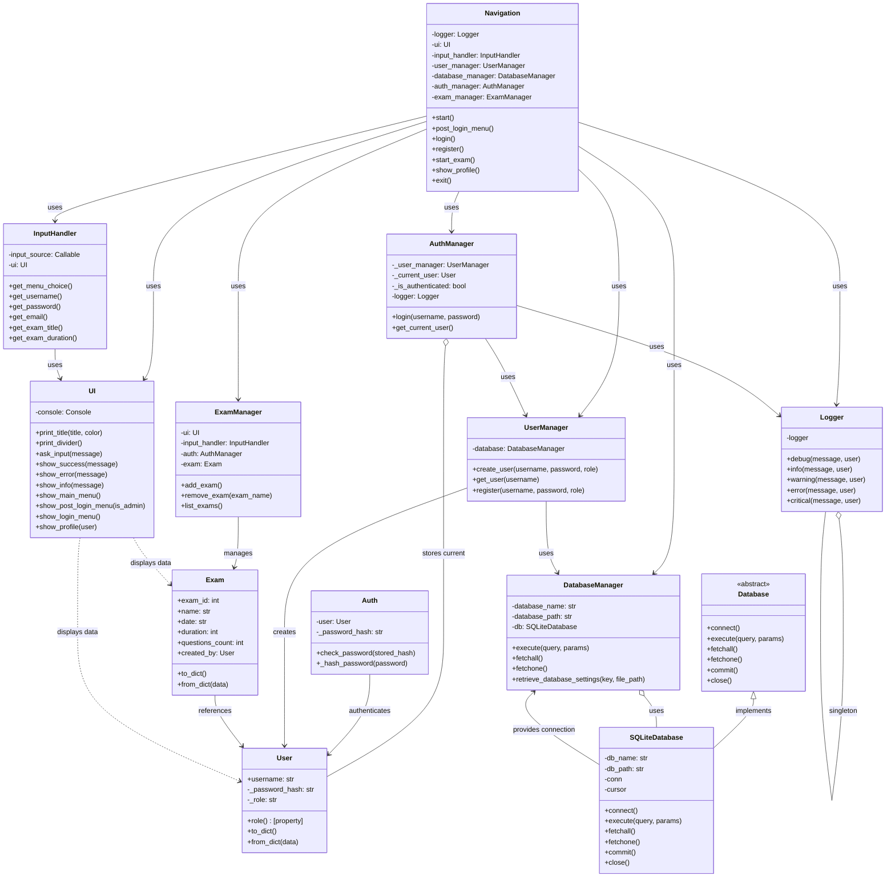
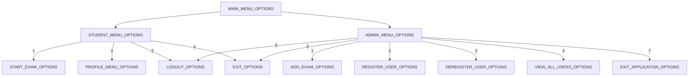

# PyExam CLI

## Overview

**PyExam CLI** is a command-line application designed for managing and taking exams. It provides a user-friendly interface for students to register, log in, take exams, and view their results — all from your terminal. The application is built in Python with a modular design, making it easy to maintain and scale.

## Features

-   🧑‍🎓 User registration and login
-   📝 Exam management system
-   📊 Result viewing
-   🎨 Styled terminal output using `rich`
-   🗃️ SQLite-based storage (no external DB required)
-   🔧 Modular architecture for clean separation of concerns
-   💻 Command-line interface with helpful prompts
-   🚀 Smooth and simple user experience

## Requirements

-   Python 3.13 or higher
-   [`rich`](https://pypi.org/project/rich/) library (for beautiful CLI output)
-   SQLite3 (bundled with Python)

## Installation

1. Clone the repository:

    ```bash
    git clone https://github.com/RupeshBhandari/pyexam-cli.git
    ```

2. Navigate to the project directory:

    ```bash
    cd pyexam-cli
    ```

3. Install required libraries:

    ```bash
    pip install rich
    ```

4. Run the application:

    ```bash
    python main.py
    ```

## Usage

1. Launch the app with:

    ```bash
    python main.py
    ```

2. Register or log in via the prompts.

3. After logging in, you can:

    - Take exams
    - View results
    - Navigate easily using CLI options

4. Use the `help` command to see available commands and actions.

## Design Architecture



---



### Database Schema

## Contributing

We welcome contributions to **PyExam CLI**!

1. Fork the repository.
2. Create a new branch for your feature or fix.
3. Commit your changes with clear messages.
4. Push to your forked repository.
5. Open a pull request to the `main` branch.
6. Ensure your code follows project standards and passes tests (if any).

## License

This project is licensed under the MIT License.  
You are free to use, modify, and distribute this software with proper attribution.

---
