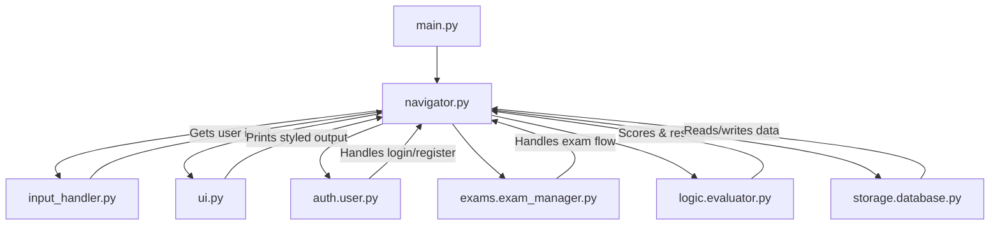

# Design

```mermaid      
flowchart TD
    A[main.py] --> B[navigator.py]
    B --> C[input_handler.py]
    B --> D[ui.py]
    
    B --> E[auth.user.py]
    B --> F[exams.exam_manager.py]
    B --> G[logic.evaluator.py]
    B --> H[storage.database.py]
    
    C -->|Gets user input| B
    D -->|Prints styled output| B
    E -->|Handles login/register| B
    F -->|Handles exam flow| B
    G -->|Scores & results| B
    H -->|Reads/writes data| B
```